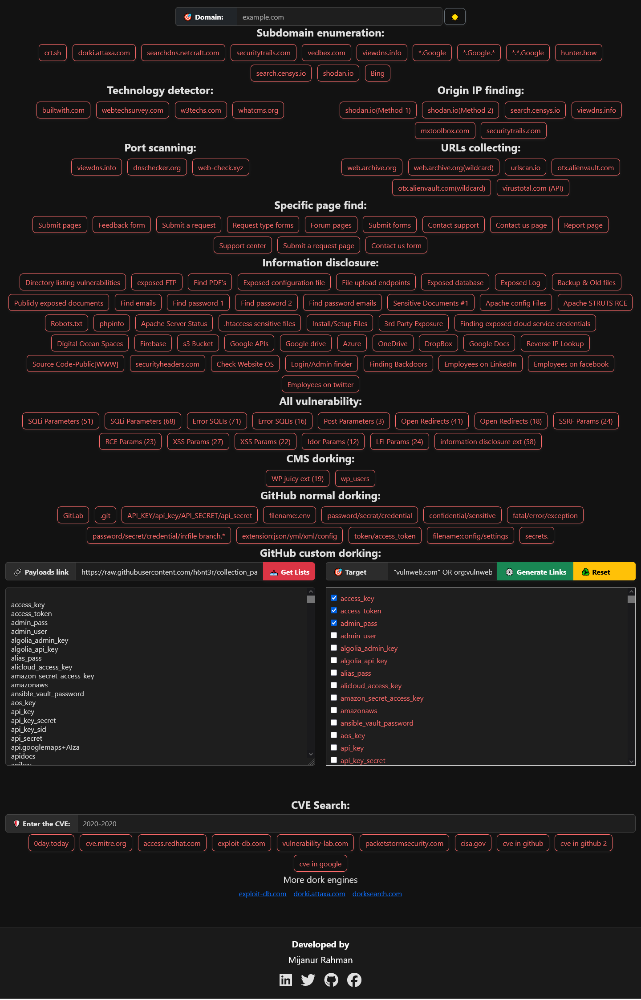

# 🔍 Advanced Recon Engine – Feature Overview

## 🌐 Purpose
**Advanced Recon Engine** is a client-side intelligence gathering tool designed to streamline and automate reconnaissance tasks in penetration testing and OSINT operations.

It features:
- Subdomain Enumeration
- Technology Detection
- Origin IP Discovery
- GitHub Dork Generation
- Google Dorking Utility
- Keyword Automation
- Responsive Theme Toggler (🌙/☀️)

# 🕳️ Dorking Toolkit Modules:

- 🌍 Generic Dorks
- 🔗 URL-based
- 🛑 Port-based
- 🧬 Git leaks
- 🧩 CMS detection
- 🧪 OR logic
- 🧨 All-in-one